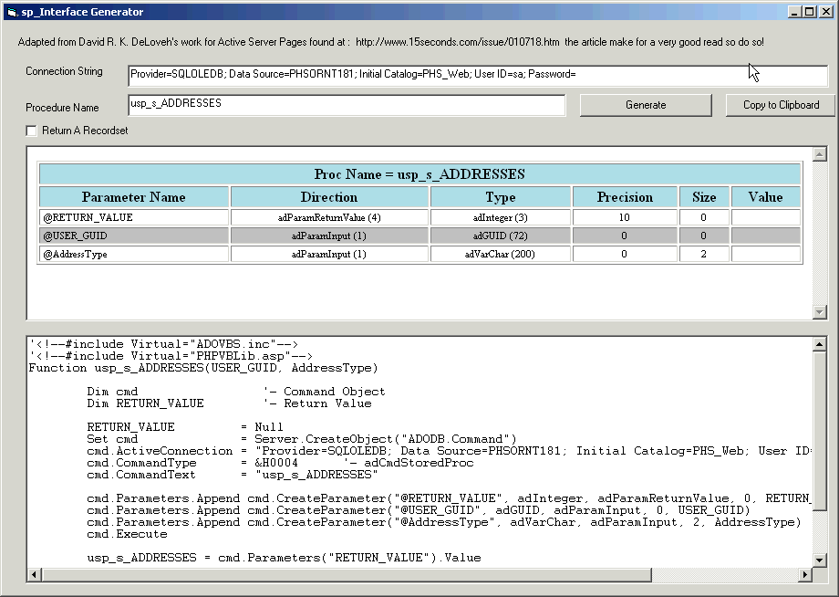



## SQL Stored Procedure Interface Generator

### Description

This nifty little program interrogates Microsoft SQL Stored Procedures and generates VB code to interface with them. The concept was Adapted for VB from David R. K. DeLoveh's work for Active Server Pages found at : http://www.15seconds.com/issue/010718.htm the article make for a very good read so do so if you can! I converted it to run under VB and spruced it up a bit. While programs like LockWoodTech's PROCEDURE BLASTER do the same thing they cost $$$ and this is free. If you like it remember to give a vote. And again thanks goes out to David R. K. DeLoveh's for his original work. With this code in hand it would be easy to modify it to be MTS/COM+ compatiable. For more extensive developers tools like this one check out www.LockWoodTech.com.
 
### More Info
 

             |
---                |---
**Submitted On**   |2001-07-23 15:57:24
**By**             |[Kevin Pirkl](https://github.com/Planet-Source-Code/PSCIndex/blob/master/ByAuthor/kevin-pirkl.md)
**Level**          |Intermediate
**User Rating**    |4.8 (29 globes from 6 users)
**Compatibility**  |VB 6\.0
**Category**       |[Databases/ Data Access/ DAO/ ADO](https://github.com/Planet-Source-Code/PSCIndex/blob/master/ByCategory/databases-data-access-dao-ado__1-6.md)
**World**          |[Visual Basic](https://github.com/Planet-Source-Code/PSCIndex/blob/master/ByWorld/visual-basic.md)
**Archive File**   |[SQL Stored233537232001\.zip](https://github.com/Planet-Source-Code/kevin-pirkl-sql-stored-procedure-interface-generator__1-25389/archive/master.zip)

